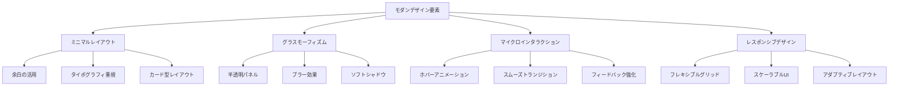

# 🎨 Steam Clicker モダンデザイン提案書

## 📋 プロジェクト概要

**テーマ**: ミニマル・エレガント  
**コンセプト**: 2025 年のモダン UI トレンドを取り入れた、シンプルで洗練されたデザイン  
**主要技術**: グラスモーフィズム、マイクロインタラクション、レスポンシブレイアウト

---

## 🎯 デザインコンセプト

### 「Clean & Sophisticated」

- **ミニマリズム**: 不要な装飾を排除し、機能性を重視
- **エレガンス**: 上品で洗練された印象
- **モダン**: 2025 年の UI トレンドを反映
- **ユーザビリティ**: 直感的で使いやすいインターフェース



---

## 🎨 カラーパレット

### **メインカラー**

```python
# ベースカラー（ライト系）
BACKGROUND_PRIMARY = (248, 249, 250)    # #F8F9FA - メイン背景
BACKGROUND_SECONDARY = (255, 255, 255)  # #FFFFFF - カード背景
BACKGROUND_TERTIARY = (250, 251, 252)   # #FAFBFC - パネル背景

# アクセントカラー
ACCENT_PRIMARY = (59, 130, 246)         # #3B82F6 - メインブルー
ACCENT_SECONDARY = (139, 92, 246)       # #8B5CF6 - パープル
ACCENT_SUCCESS = (34, 197, 94)          # #22C55E - グリーン
ACCENT_WARNING = (251, 146, 60)         # #FB923C - オレンジ
ACCENT_ERROR = (239, 68, 68)            # #EF4444 - レッド

# グレースケール
GRAY_50 = (249, 250, 251)   # #F9FAFB - 最も薄い
GRAY_100 = (243, 244, 246)  # #F3F4F6
GRAY_200 = (229, 231, 235)  # #E5E7EB
GRAY_300 = (209, 213, 219)  # #D1D5DB
GRAY_400 = (156, 163, 175)  # #9CA3AF
GRAY_500 = (107, 114, 128)  # #6B7280 - 中間
GRAY_600 = (75, 85, 99)     # #4B5563
GRAY_700 = (55, 65, 81)     # #374151
GRAY_800 = (31, 41, 55)     # #1F2937
GRAY_900 = (17, 24, 39)     # #111827 - 最も濃い

# テキストカラー
TEXT_PRIMARY = (17, 24, 39)     # #111827 - メインテキスト
TEXT_SECONDARY = (75, 85, 99)   # #4B5563 - サブテキスト
TEXT_TERTIARY = (156, 163, 175) # #9CA3AF - 補助テキスト
TEXT_INVERSE = (255, 255, 255)  # #FFFFFF - 反転テキスト
```

### **グラデーション**

```python
# カード用グラデーション
GRADIENT_CARD = "linear-gradient(135deg, rgba(255,255,255,0.9) 0%, rgba(255,255,255,0.7) 100%)"

# ボタン用グラデーション
GRADIENT_BUTTON_PRIMARY = "linear-gradient(135deg, #3B82F6 0%, #1D4ED8 100%)"
GRADIENT_BUTTON_SUCCESS = "linear-gradient(135deg, #22C55E 0%, #15803D 100%)"
GRADIENT_BUTTON_WARNING = "linear-gradient(135deg, #FB923C 0%, #EA580C 100%)"

# 背景用グラデーション
GRADIENT_BACKGROUND = "linear-gradient(135deg, #F8F9FA 0%, #F1F5F9 100%)"
```

---

## 🏗️ レイアウト設計

### **1. 全体構成**

```
┌─────────────────────────────────────────────────────────────────────────┐
│                           🎮 Steam Clicker Pro                          │
│                     [🌙 Dark] [⚙️ Settings] [📊 Stats]                  │
├─────────────────────────────────────────────────────────────────────────┤
│                                                                         │
│  ┌─────────────┐  ┌─────────────┐  ┌─────────────┐  ┌─────────────┐    │
│  │  💰 総資産   │  │  🎮 積みゲー │  │  💼 賃金     │  │  ⚡ 自動化   │    │
│  │             │  │             │  │             │  │             │    │
│  │ 1,234,567円 │  │    50個     │  │  1,000円    │  │  2.5回/秒   │    │
│  └─────────────┘  └─────────────┘  └─────────────┘  └─────────────┘    │
│                                                                         │
│  ┌─────────────────────────────────────────────────────────────────────┐ │
│  │                        🎯 メインアクション                          │ │
│  │                                                                     │ │
│  │    ┌─────────────────┐              ┌─────────────────┐             │ │
│  │    │                 │              │                 │             │ │
│  │    │    💪 労働       │              │    🛒 購入       │             │ │
│  │    │                 │              │                 │             │ │
│  │    │   クリック！     │              │  ゲーム購入      │             │ │
│  │    │                 │              │   100円/個      │             │ │
│  │    └─────────────────┘              └─────────────────┘             │ │
│  └─────────────────────────────────────────────────────────────────────┘ │
│                                                                         │
│  ┌─────────────────────────────────────────────────────────────────────┐ │
│  │                        🚀 アップグレード                            │ │
│  │                                                                     │ │
│  │  ┌─────────┐ ┌─────────┐ ┌─────────┐ ┌─────────┐ ┌─────────┐ ┌─────┐ │ │
│  │  │   📈    │ │   🛍️    │ │   🤖    │ │   🛒    │ │   💻    │ │ 🎮  │ │ │
│  │  │  労働DX  │ │ 購入力UP │ │ 自動労働 │ │ 自動購入 │ │ゲーミングPC│ │早期 │ │ │
│  │  │         │ │         │ │         │ │         │ │         │ │アク │ │ │
│  │  │ 200円   │ │ 300円   │ │ 400円   │ │ 500円   │ │ 1,000円 │ │セス │ │ │
│  │  │ 所持:0  │ │ 所持:0  │ │ 所持:0  │ │ 所持:0  │ │ Lv.0   │ │2000 │ │ │
│  │  └─────────┘ └─────────┘ └─────────┘ └─────────┘ └─────────┘ └─────┘ │ │
│  └─────────────────────────────────────────────────────────────────────┘ │
└─────────────────────────────────────────────────────────────────────────┘
```

### **2. グリッドシステム**

```python
# レスポンシブグリッド設定
GRID_COLUMNS = 12
GRID_GAP = 24  # px

# ブレークポイント
BREAKPOINTS = {
    'xs': 0,      # モバイル
    'sm': 640,    # タブレット縦
    'md': 768,    # タブレット横
    'lg': 1024,   # デスクトップ小
    'xl': 1280,   # デスクトップ大
    '2xl': 1536   # デスクトップ特大
}

# コンポーネントサイズ
COMPONENT_SIZES = {
    'stats_cards': {'cols': 3, 'height': 120},      # 統計カード
    'main_actions': {'cols': 12, 'height': 200},    # メインアクション
    'upgrades': {'cols': 12, 'height': 400},        # アップグレード
}
```

---

## 🎨 コンポーネント設計

### **1. ヘッダーコンポーネント**

```python
class ModernHeader:
    def __init__(self):
        self.height = 80
        self.background = BACKGROUND_SECONDARY
        self.shadow = "0 1px 3px rgba(0,0,0,0.1)"
        self.border_radius = 0

    def render(self, screen):
        # タイトル
        title = "🎮 Steam Clicker Pro"
        title_font = pygame.font.Font("fonts/Inter-Bold.ttf", 24)

        # アクションボタン
        actions = ["🌙 Dark", "⚙️ Settings", "📊 Stats"]

        # 総資産表示
        money_display = f"💰 {format_currency(game_state.money)}"
```

### **2. 統計カードコンポーネント**

```python
class StatsCard:
    def __init__(self, icon, title, value, subtitle=""):
        self.icon = icon
        self.title = title
        self.value = value
        self.subtitle = subtitle

        # グラスモーフィズム設定
        self.background = "rgba(255, 255, 255, 0.7)"
        self.backdrop_filter = "blur(10px)"
        self.border = "1px solid rgba(255, 255, 255, 0.3)"
        self.border_radius = 16
        self.shadow = "0 8px 32px rgba(0, 0, 0, 0.1)"

    def render(self, screen, x, y, width, height):
        # カード背景（グラスモーフィズム）
        card_surface = pygame.Surface((width, height), pygame.SRCALPHA)

        # 背景色（半透明）
        pygame.draw.rect(card_surface, (255, 255, 255, 180),
                        (0, 0, width, height), border_radius=16)

        # 境界線
        pygame.draw.rect(card_surface, (255, 255, 255, 76),
                        (0, 0, width, height), 2, border_radius=16)

        # アイコン
        icon_font = pygame.font.Font("fonts/NotoEmoji.ttf", 32)
        icon_surface = icon_font.render(self.icon, True, TEXT_PRIMARY)

        # タイトル
        title_font = pygame.font.Font("fonts/Inter-Medium.ttf", 14)
        title_surface = title_font.render(self.title, True, TEXT_SECONDARY)

        # 値
        value_font = pygame.font.Font("fonts/Inter-Bold.ttf", 24)
        value_surface = value_font.render(self.value, True, TEXT_PRIMARY)

        # サブタイトル
        if self.subtitle:
            subtitle_font = pygame.font.Font("fonts/Inter-Regular.ttf", 12)
            subtitle_surface = subtitle_font.render(self.subtitle, True, TEXT_TERTIARY)
```

### **3. モダンボタンコンポーネント**

```python
class ModernButton:
    def __init__(self, text, button_type="primary", size="medium"):
        self.text = text
        self.button_type = button_type
        self.size = size
        self.is_hovered = False
        self.is_pressed = False

        # サイズ設定
        self.sizes = {
            'small': {'height': 36, 'padding': 12, 'font_size': 14},
            'medium': {'height': 44, 'padding': 16, 'font_size': 16},
            'large': {'height': 56, 'padding': 24, 'font_size': 18}
        }

        # タイプ別設定
        self.types = {
            'primary': {
                'background': ACCENT_PRIMARY,
                'text_color': TEXT_INVERSE,
                'hover_background': (29, 78, 216),  # blue-700
                'shadow': "0 4px 14px rgba(59, 130, 246, 0.4)"
            },
            'success': {
                'background': ACCENT_SUCCESS,
                'text_color': TEXT_INVERSE,
                'hover_background': (21, 128, 61),  # green-700
                'shadow': "0 4px 14px rgba(34, 197, 94, 0.4)"
            },
            'secondary': {
                'background': GRAY_100,
                'text_color': TEXT_PRIMARY,
                'hover_background': GRAY_200,
                'shadow': "0 2px 8px rgba(0, 0, 0, 0.1)"
            }
        }

    def render(self, screen, x, y, width):
        size_config = self.sizes[self.size]
        type_config = self.types[self.button_type]

        height = size_config['height']

        # ホバー・プレス状態の色
        if self.is_pressed:
            bg_color = tuple(max(0, c - 30) for c in type_config['background'])
        elif self.is_hovered:
            bg_color = type_config['hover_background']
        else:
            bg_color = type_config['background']

        # ボタン背景
        button_rect = pygame.Rect(x, y, width, height)
        pygame.draw.rect(screen, bg_color, button_rect, border_radius=12)

        # シャドウ効果（簡易版）
        if not self.is_pressed:
            shadow_rect = pygame.Rect(x, y + 2, width, height)
            shadow_color = (*bg_color[:3], 100)  # 半透明
            pygame.draw.rect(screen, shadow_color, shadow_rect, border_radius=12)

        # テキスト
        font = pygame.font.Font("fonts/Inter-SemiBold.ttf", size_config['font_size'])
        text_surface = font.render(self.text, True, type_config['text_color'])
        text_rect = text_surface.get_rect(center=button_rect.center)
        screen.blit(text_surface, text_rect)
```

### **4. アップグレードカードコンポーネント**

```python
class UpgradeCard:
    def __init__(self, upgrade_data, index):
        self.upgrade = upgrade_data
        self.index = index
        self.is_hovered = False
        self.is_affordable = False

    def render(self, screen, x, y, width, height):
        # カード背景（グラスモーフィズム）
        card_surface = pygame.Surface((width, height), pygame.SRCALPHA)

        # 購入可能かどうかで色を変更
        if self.is_affordable:
            bg_alpha = 200
            border_color = ACCENT_PRIMARY
        else:
            bg_alpha = 120
            border_color = GRAY_300

        # 背景
        pygame.draw.rect(card_surface, (*BACKGROUND_SECONDARY, bg_alpha),
                        (0, 0, width, height), border_radius=16)

        # ホバー効果
        if self.is_hovered:
            pygame.draw.rect(card_surface, (*ACCENT_PRIMARY, 30),
                            (0, 0, width, height), border_radius=16)

        # 境界線
        pygame.draw.rect(card_surface, border_color,
                        (0, 0, width, height), 2, border_radius=16)

        # アイコン
        icon_size = 48
        icon_x = x + 16
        icon_y = y + 16

        if self.index < len(upgrade_icons):
            icon = pygame.transform.scale(upgrade_icons[self.index], (icon_size, icon_size))
            screen.blit(icon, (icon_x, icon_y))

        # タイトル
        title_font = pygame.font.Font("fonts/Inter-SemiBold.ttf", 16)
        title_surface = title_font.render(self.upgrade['name'], True, TEXT_PRIMARY)
        screen.blit(title_surface, (icon_x + icon_size + 12, icon_y))

        # 価格
        price_font = pygame.font.Font("fonts/Inter-Bold.ttf", 18)
        price_text = format_currency(self.upgrade['cost'])
        price_color = ACCENT_SUCCESS if self.is_affordable else TEXT_TERTIARY
        price_surface = price_font.render(price_text, True, price_color)
        screen.blit(price_surface, (icon_x + icon_size + 12, icon_y + 24))

        # 所持数/レベル
        count_font = pygame.font.Font("fonts/Inter-Medium.ttf", 14)
        if self.index == 4:  # ゲーミングPC
            count_text = f"Lv.{self.upgrade['effect']}" if self.upgrade['effect'] > 0 else "未所持"
        else:
            count_text = f"所持: {self.upgrade['count']}"
        count_surface = count_font.render(count_text, True, TEXT_SECONDARY)
        screen.blit(count_surface, (icon_x + icon_size + 12, icon_y + 48))

        # 説明文
        desc_font = pygame.font.Font("fonts/Inter-Regular.ttf", 12)
        desc_surface = desc_font.render(self.upgrade['description'], True, TEXT_TERTIARY)
        screen.blit(desc_surface, (x + 16, y + height - 32))
```

---

## ✨ アニメーション・エフェクト

### **1. マイクロインタラクション**

```python
class AnimationManager:
    def __init__(self):
        self.animations = []

    def add_hover_effect(self, component, duration=0.2):
        """ホバー時のスケールアニメーション"""
        animation = {
            'type': 'scale',
            'target': component,
            'from': 1.0,
            'to': 1.05,
            'duration': duration,
            'easing': 'ease_out'
        }
        self.animations.append(animation)

    def add_click_feedback(self, component, duration=0.1):
        """クリック時のフィードバック"""
        animation = {
            'type': 'scale',
            'target': component,
            'from': 1.0,
            'to': 0.95,
            'duration': duration,
            'easing': 'ease_in_out'
        }
        self.animations.append(animation)

    def add_success_pulse(self, component, duration=0.6):
        """成功時のパルスエフェクト"""
        animation = {
            'type': 'pulse',
            'target': component,
            'color': ACCENT_SUCCESS,
            'duration': duration,
            'easing': 'ease_out'
        }
        self.animations.append(animation)
```

### **2. トランジション効果**

```python
class TransitionEffects:
    @staticmethod
    def fade_in(surface, duration=0.3):
        """フェードイン効果"""
        pass

    @staticmethod
    def slide_up(surface, distance=20, duration=0.4):
        """スライドアップ効果"""
        pass

    @staticmethod
    def bounce_in(surface, duration=0.5):
        """バウンスイン効果"""
        pass
```

### **3. パーティクルエフェクト**

```python
class ParticleSystem:
    def __init__(self):
        self.particles = []

    def create_success_particles(self, x, y, count=10):
        """成功時のパーティクル"""
        for i in range(count):
            particle = {
                'x': x + random.randint(-20, 20),
                'y': y + random.randint(-20, 20),
                'vx': random.uniform(-2, 2),
                'vy': random.uniform(-3, -1),
                'life': 1.0,
                'color': ACCENT_SUCCESS,
                'size': random.randint(2, 6)
            }
            self.particles.append(particle)

    def create_money_particles(self, x, y, amount):
        """お金獲得時のパーティクル"""
        particle_count = min(20, amount // 100)  # 金額に応じて数を調整
        for i in range(particle_count):
            particle = {
                'x': x,
                'y': y,
                'vx': random.uniform(-3, 3),
                'vy': random.uniform(-4, -1),
                'life': 1.5,
                'color': (255, 215, 0),  # ゴールド
                'size': random.randint(3, 8),
                'text': '¥'
            }
            self.particles.append(particle)
```

---

## 📱 レスポンシブ対応

### **1. ブレークポイント設計**

```python
class ResponsiveLayout:
    def __init__(self, screen_width, screen_height):
        self.width = screen_width
        self.height = screen_height
        self.breakpoint = self.get_breakpoint()

    def get_breakpoint(self):
        if self.width >= 1536:
            return '2xl'
        elif self.width >= 1280:
            return 'xl'
        elif self.width >= 1024:
            return 'lg'
        elif self.width >= 768:
            return 'md'
        elif self.width >= 640:
            return 'sm'
        else:
            return 'xs'

    def get_layout_config(self):
        layouts = {
            'xs': {  # モバイル
                'stats_cards': {'cols': 1, 'rows': 4},
                'main_actions': {'cols': 1, 'rows': 2},
                'upgrades': {'cols': 2, 'rows': 3}
            },
            'sm': {  # タブレット縦
                'stats_cards': {'cols': 2, 'rows': 2},
                'main_actions': {'cols': 2, 'rows': 1},
                'upgrades': {'cols': 3, 'rows': 2}
            },
            'md': {  # タブレット横
                'stats_cards': {'cols': 4, 'rows': 1},
                'main_actions': {'cols': 2, 'rows': 1},
                'upgrades': {'cols': 3, 'rows': 2}
            },
            'lg': {  # デスクトップ小
                'stats_cards': {'cols': 4, 'rows': 1},
                'main_actions': {'cols': 2, 'rows': 1},
                'upgrades': {'cols': 6, 'rows': 1}
            },
            'xl': {  # デスクトップ大
                'stats_cards': {'cols': 4, 'rows': 1},
                'main_actions': {'cols': 2, 'rows': 1},
                'upgrades': {'cols': 6, 'rows': 1}
            }
        }
        return layouts[self.breakpoint]
```

---

## 🎨 実装優先順位

### **Phase 1: 基本レイアウト（1-2 週間）**

1. ✅ 新しいカラーパレットの適用
2. ✅ グリッドシステムの実装
3. ✅ ヘッダーコンポーネントの作成
4. ✅ 統計カードの実装

### **Phase 2: コンポーネント強化（2-3 週間）**

1. ✅ モダンボタンの実装
2. ✅ アップグレードカードの再設計
3. ✅ グラスモーフィズム効果の追加
4. ✅ ホバー・クリック効果の実装

### **Phase 3: アニメーション（1-2 週間）**

1. ✅ マイクロインタラクションの追加
2. ✅ トランジション効果の実装
3. ✅ パーティクルシステムの構築
4. ✅ フィードバック強化

### **Phase 4: 最適化・仕上げ（1 週間）**

1. ✅ レスポンシブ対応
2. ✅ パフォーマンス最適化
3. ✅ アクセシビリティ対応
4. ✅ 最終調整

---

## 🔧 技術仕様

### **必要なライブラリ**

```python
# 基本
import pygame
import pygame.gfxdraw  # アンチエイリアス描画
import math
import random

# アニメーション
import easing_functions  # イージング関数
import time

# フォント
# Inter フォントファミリー（Google Fonts）
# Noto Emoji（絵文字用）
```

### **フォント設定**

```python
FONTS = {
    'heading': pygame.font.Font("fonts/Inter-Bold.ttf", 32),
    'subheading': pygame.font.Font("fonts/Inter-SemiBold.ttf", 24),
    'body': pygame.font.Font("fonts/Inter-Regular.ttf", 16),
    'caption': pygame.font.Font("fonts/Inter-Medium.ttf", 14),
    'small': pygame.font.Font("fonts/Inter-Regular.ttf", 12),
    'emoji': pygame.font.Font("fonts/NotoEmoji.ttf", 24)
}
```

### **パフォーマンス考慮**

```python
# Surface キャッシュ
surface_cache = {}

# 描画最適化
def optimized_draw():
    # 変更された部分のみ再描画
    # ダーティレクト方式の採用
    pass

# メモリ管理
def cleanup_resources():
    # 不要なSurfaceの解放
    # ガベージコレクション
    pass
```

---

## 📊 期待される効果

### **ユーザーエクスペリエンス向上**

- 🎯 **直感的操作**: モダンな UI パターンによる操作性向上
- ✨ **視覚的魅力**: グラスモーフィズムによる美しい見た目
- 🚀 **レスポンシブ**: あらゆるデバイスサイズに対応
- 💫 **マイクロインタラクション**: 操作の楽しさ向上

### **技術的メリット**

- 🔧 **保守性**: コンポーネント化による管理しやすさ
- 📱 **拡張性**: レスポンシブ設計による将来対応
- ⚡ **パフォーマンス**: 最適化された描画処理
- 🎨 **カスタマイズ性**: テーマ切り替え対応

---

## 🎉 まとめ

この提案により、Steam Clicker は**2025 年のモダン UI トレンド**を取り入れた、**シンプルで洗練された**ゲ
